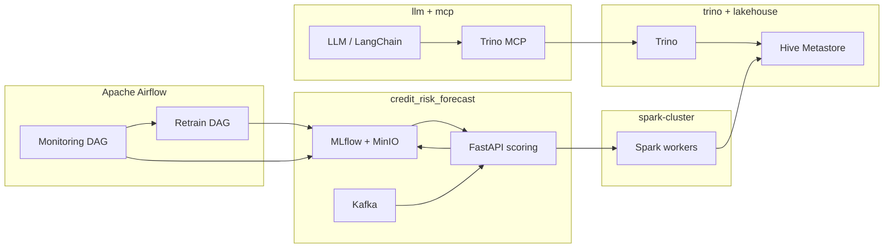

# Credit risk forecast

End-to-end **credit scoring** and **MLOps** reference: train a **LightGBM** pipeline, track experiments in **MLflow**, serve predictions from a **FastAPI** service, stream scoring traffic through **Kafka**, and persist decision outcomes to a **lakehouse** path using **PySpark** against a shared **Hive Metastore** and **S3-compatible** object storage (**MinIO**). Orchestration for scheduled monitoring, conditional retraining, and CI-triggered training is handled by **Apache Airflow**.

This folder is designed to sit beside the rest of the workspace so you can wire the same networks, catalogs, and agent tooling into one coherent analytics and ML story.

---

## What this repository contains

| Area | Role |
|------|------|
| [`prod/lgbm_prod.py`](prod/lgbm_prod.py) | Production API: loads a registered model from **MLflow**, `/predict` scoring, optional **Kafka** consumer, **Spark** batch writes for prediction logging. |
| [`dags/`](dags/) | **Airflow** DAG definitions and callable pipelines (`pipelines/train_model.py`, drift / decay checks). |
| [`docker-compose.yml`](docker-compose.yml) | Core stack: Postgres + **MLflow** (with auth), **MinIO**, scoring API, **Kafka**; attaches to external Docker networks shared with other projects. |
| [`docker-compose.airflow.yml`](docker-compose.airflow.yml) | **Apache Airflow** 3.x (Celery executor): scheduler, workers, API server, and DAG volume mounts for training and **NannyML**-style monitoring. |
| [`client/kafka_request_generator.py`](client/kafka_request_generator.py) | Helper to exercise the async scoring path. |
| [`docker/nannyml-evaluator/`](docker/nannyml-evaluator/) | Containerized evaluation script used from Airflow’s **DockerOperator**. |
| [`.github/workflows/ci-cd.yml`](.github/workflows/ci-cd.yml) | Tests on PRs; image publish; optional workflow dispatch to integrate with remote **Airflow**. |

Training reads labeled tables (CSV/Parquet, including **S3** URIs backed by MinIO), fits a sklearn **Pipeline** with **LGBMClassifier**, logs metrics and registers the model in **MLflow**.

---

## Apache Airflow

**Airflow** is the control plane for **repeatable ML workflows**:

- **`credit_model_training_and_nannyml_monitoring`** — daily schedule: runs drift / model-decay monitoring (via **DockerOperator** + the NannyML evaluator image), branches on the result, and can **TriggerDagRun** the retrain DAG when retraining is warranted.
- **`credit_model_retrain_from_github_actions`** — on-demand / **GitHub Actions**–friendly: runs `pipelines/train_model.py` with environment injected from `pipelines/mlflow_training_env.py` to register a new model in **MLflow**.

Bring the Airflow stack up with `docker-compose.airflow.yml` (see that file for services: Postgres, Redis, scheduler, workers, API server, init). DAG code lives under [`dags/`](dags/). Workers receive MinIO credentials and data paths via environment variables so training and monitoring jobs read/write the same artifact layout as the main compose stack.

---

## How this aligns with the rest of the workspace

The following sibling directories are **not** submodules of this repo; they are **companion stacks** you run and connect with Docker networks and environment variables.

### [`spark-cluster`](../spark-cluster)

The Spark **master** and **worker** compose file joins external networks `minio_minio` and **`credit_risk_shared`**, matching [`docker-compose.yml`](docker-compose.yml) in this project. The scoring API defaults (`SPARK_MASTER_URL`, `SPARK_HIVE_METASTORE_URIS`, `SPARK_SQL_WAREHOUSE_DIR`) assume executors can reach **`spark-master`** and a **Hive Metastore** thrift endpoint, with warehouse data on **`s3a://`** backed by MinIO. Use this cluster when you want distributed writes and Spark UI visibility for prediction logging and ETL-sized jobs.

### [`trino`](../trino)

The **Trino** stack (query engine, **Hive Metastore**, **ClickHouse**, etc.) is another consumer of the same **MinIO**-backed lakehouse idea: federated SQL over Iceberg-style catalogs and companion stores. After this service writes **prediction events** and related tables through Spark, **Trino** is the natural place for **ad hoc SQL**, BI, and data quality checks on the same namespaces.

### [`llm`](../llm)

The **LLM Analytics Assistant** demonstrates **natural language → Trino SQL** (via LangChain and MCP), **RAG** over documents, and **LoRA** fine-tuning with **MLflow** tracking in notebooks. Conceptually:

- **This project** owns **batch training**, **registry promotion**, **online scoring**, and **Airflow**-driven **monitoring / retrain** loops.
- **`llm`** sits on the **analyst and agent** side: asking questions and generating read-only SQL against the warehouse **Trino** exposes—including tables populated or enriched by the credit-risk pipeline.

Shared themes: **MLflow** for experiment lineage, **MinIO**-compatible **S3** paths for artifacts and data, and **Trino** as the read path for structured truth.

### [`mcp`](../mcp)

The **`mcp`** folder hosts a **Model Context Protocol** server (**`trino_mcp.py`**) that exposes **Trino** as tools for IDEs and agents. That is the bridge between **conversational interfaces** (for example notebooks in **`llm`**) and **live warehouse metadata and SQL execution**. Point MCP clients at this server with the same **Trino** host and credentials you use for the **`trino`** compose stack so agents query the same catalogs this pipeline ultimately feeds.

---

## End-to-end picture

---

## Quick start pointers

1. Ensure external Docker networks exist (names used in compose: **`minio_minio`**, **`credit_risk_shared`**) and that **MinIO** / **Hive Metastore** / **Spark** are reachable as configured in your `.env`.
2. From this directory: `docker compose up` for **MLflow**, **API**, **Kafka**, and dependencies (see [`docker-compose.yml`](docker-compose.yml)).
3. For **Airflow**: `docker compose -f docker-compose.airflow.yml up` after aligning environment variables with your MinIO and API endpoints (see comments and defaults in that file).
4. Run tests locally: `python -m pytest` (see [`pytest.ini`](pytest.ini) and [`requirements-ci.txt`](requirements-ci.txt) as referenced in CI).

For deeper notebook and MCP setup, follow [`../llm/README.md`](../llm/README.md). For the query engine and catalog layout, see [`../trino/README.md`](../trino/README.md).
