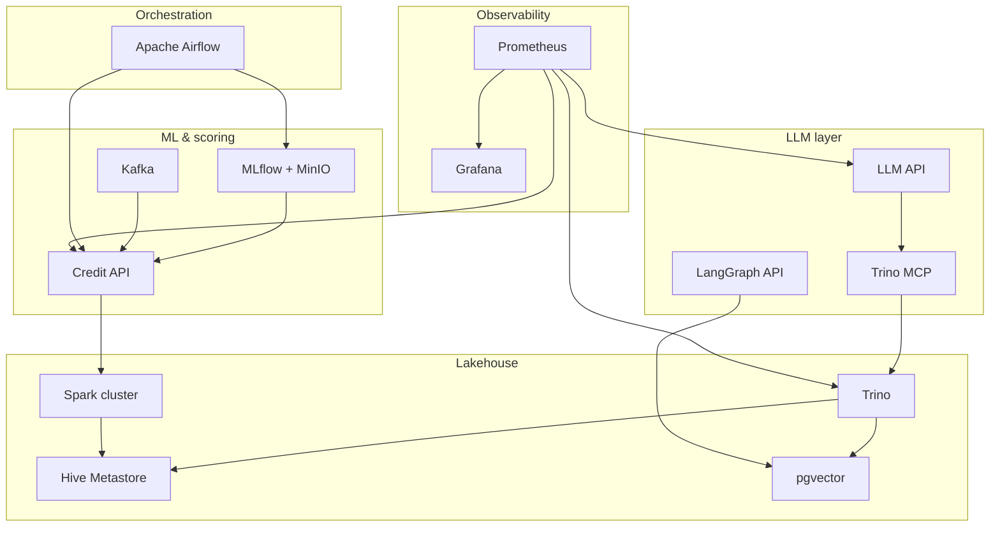

# Data Platform Monorepo

An end-to-end **analytics and ML platform** that combines credit-risk scoring, lakehouse query engines, distributed Spark, LLM-powered natural-language analytics, workflow orchestration, and observability. The same services run locally via **Docker Compose**, on a **kind** cluster, or on **AWS EKS** provisioned with **Terraform**.

---

## What this platform does

| Capability | Components | Outcome |
|------------|------------|---------|
| **ML training & serving** | MLflow, LightGBM, FastAPI | Train, register, and serve credit-scoring models with experiment tracking |
| **Streaming inference** | Kafka, Credit API | Async scoring via message queue |
| **Lakehouse persistence** | Spark, Hive Metastore, MinIO, Iceberg | Write prediction events to object storage with table metadata |
| **Federated SQL** | Trino, pgvector | Query Iceberg tables, PostgreSQL, and benchmarks from one engine |
| **Workflow orchestration** | Apache Airflow | Scheduled monitoring, drift checks, and conditional retraining |
| **LLM analytics** | Qwen + LoRA, LangChain, LangGraph | RAG over documents, NL → SQL via Trino MCP, result summarization |
| **Agent tooling** | Trino MCP server | Expose warehouse metadata and SQL as MCP tools for IDEs and agents |
| **Observability** | Prometheus, Grafana, Alertmanager | Metrics, dashboards, and alerts for local and K8s deployments |
| **Cloud deployment** | Terraform, EKS, ECR, ALB | Production-style AWS infrastructure with HTTPS ingress |

---

## Architecture



**Data flow (simplified):**

1. **Airflow** runs training and monitoring DAGs → registers models in **MLflow** (artifacts on **MinIO**).
2. **Credit API** loads the registered model, serves `/predict`, consumes **Kafka** messages, and writes prediction logs to **Iceberg** via **Spark**.
3. **Trino** federates SQL over Iceberg (`iceberg` catalog), PostgreSQL/pgvector (`pgvector` catalog), and TPC benchmarks.
4. **LLM APIs** answer questions over uploaded documents (RAG → pgvector) and generate read-only SQL against Trino via the **MCP** bridge.
5. **Prometheus** scrapes application and container metrics; **Grafana** visualizes the platform.

---

## Repository layout

| Path | Purpose | Documentation |
|------|---------|---------------|
| [`credit_risk_forecast/`](credit_risk_forecast/) | LightGBM training, MLflow, FastAPI scoring, Kafka, Airflow DAGs | [README](credit_risk_forecast/README.md) |
| [`trino/`](trino/) | Trino coordinator, Hive Metastore, MySQL, pgvector | [README](trino/README.md) |
| [`spark-cluster/`](spark-cluster/) | Spark standalone master + worker | [README](spark-cluster/README.md) |
| [`llm/`](llm/) | LLM fine-tuning notebooks, FastAPI services (LangChain + LangGraph) | [README](llm/README.md) |
| [`mcp/`](mcp/) | Trino Model Context Protocol server | [README](mcp/README.md) |
| [`observability/`](observability/) | Prometheus, Grafana, Alertmanager, cAdvisor | [README](observability/README.md) |
| [`k8s/`](k8s/) | Kubernetes manifests (kind / EKS) | [README](k8s/README.md) |
| [`terraform/`](terraform/) | AWS VPC, EKS, ECR, ALB, ACM | [README](terraform/README.md) |
| [`scripts/`](scripts/) | One-command local platform up/down/setup | [README](scripts/README.md) |
| [`client/`](client/) | Kafka load generator for async scoring | [README](client/README.md) |

---

## Quick start (local Docker)

### Prerequisites

- [Docker](https://docs.docker.com/get-docker/) with the Compose plugin (`docker compose`)
- **12+ GiB RAM** recommended (LLM first start can use 4–8 GiB for model download)
- Optional: `HF_TOKEN` in `llm/.env` for Hugging Face model download

### One command

```bash
make setup
```

This runs `scripts/local-platform-setup.sh`, which:

1. Checks Docker is running
2. Creates `.env` files from samples when missing
3. Starts all compose stacks in dependency order
4. Waits for key health endpoints (MLflow, Credit API, Trino, Grafana, LLM API)

### Recreate all containers

After compose, env, or Grafana dashboard changes:

```bash
LOCAL_FORCE_RECREATE=1 make setup
# or
make setup-fresh
```

### Stop and status

```bash
make local-down      # stop everything
make local-status    # docker compose ps per stack
make local-logs-llm  # follow LLM container logs
```

### Service URLs (localhost)

| Service | URL | Credentials |
|---------|-----|-------------|
| Credit API | http://localhost:8000 | — |
| Credit API health | http://localhost:8000/health | — |
| MLflow | http://localhost:5000 | `admin` / `password1234` |
| LLM API (Swagger) | http://localhost:8001/docs | — |
| LangGraph API | http://localhost:8002/docs | — |
| Trino | http://localhost:8086 | JDBC `jdbc:trino://localhost:8086` |
| pgvector (Postgres) | `localhost:5433` | `vector` / `vector`, db `vectors` |
| MinIO console | http://localhost:9001 | see `credit_risk_forecast/.env` |
| Airflow | http://localhost:8085 | `airflow` / `airflow` |
| Spark master UI | http://localhost:8083 | — |
| Trino MCP (SSE) | http://localhost:8765/sse | — |
| Grafana | http://localhost:3000 | `admin` / `admin` |
| Prometheus | http://localhost:9090 | — |
| Alertmanager | http://localhost:9093 | — |
| cAdvisor | http://localhost:8088 | — |
| Kafka (host) | `localhost:29092` | topic `predict` |

### Credit API — first prediction

The Credit API needs a model registered in MLflow. After the stack is up:

1. Train and register a model (notebook or Airflow DAG), or follow [`credit_risk_forecast/para_rodar_o_projeto.txt`](credit_risk_forecast/para_rodar_o_projeto.txt).
2. `POST http://localhost:8000/predict` with a JSON body (see that file for a full example).

### LLM RAG workflow

```bash
# 1. Upload documents
curl -F "files=@document.pdf" http://localhost:8001/documents/uploads

# 2. Ingest into pgvector
curl -X POST http://localhost:8001/documents/ingest

# 3. Ask questions
curl -X POST http://localhost:8001/ask \
  -H "Content-Type: application/json" \
  -d '{"question": "What are the key terms?"}'

# Or use the LangGraph path
curl -X POST http://localhost:8002/ask/langgraph \
  -H "Content-Type: application/json" \
  -d '{"question": "What are the key terms?"}'
```

### Trino — example queries

```sql
-- Benchmark data
SELECT * FROM tpch.tiny.nation LIMIT 5;

-- RAG document store (after LLM ingest)
SELECT * FROM pgvector.public.rag_documents;

-- Iceberg tables (after Credit API writes via Spark)
SELECT * FROM iceberg.forecast.prediction_events LIMIT 10;
```

---

## Deployment options

### Local Docker Compose

Orchestrated by [`scripts/local-platform-up.sh`](scripts/local-platform-up.sh). Each component has its own `docker-compose.yml`; shared Docker networks (`minio_minio`, `credit_risk_shared`, `trino_trino-network`) let services resolve each other by hostname.

**Startup order:** credit_risk_forecast → Airflow → trino → spark → llm → observability.

### Kubernetes (kind)

```bash
cd k8s
cp .env.example .env   # set HF_TOKEN, MLFLOW_MODEL_URI, etc.
make up              # cluster + build + load images + deploy
```

Service DNS names match Docker Compose so application config transfers unchanged. See [`k8s/README.md`](k8s/README.md) for NodePort mappings, ingress hostnames, HPA, and observability.

### AWS EKS (Terraform)

```bash
cd terraform
cp .env.example .env && cp terraform.tfvars.example terraform.tfvars
make bootstrap-setup   # optional: remote state
make apply

cd ../k8s && cp .env.example .env
bash scripts/push-images-ecr.sh
bash scripts/deploy-eks.sh
```

See [`terraform/README.md`](terraform/README.md) for sizing, ALB/ACM setup, and production recommendations.

---

## Shared Docker networks

| Network | Purpose |
|---------|---------|
| `minio_minio` | Object storage access (MinIO S3 API) |
| `credit_risk_shared` | Credit API, Kafka, Spark, cross-stack connectivity |
| `trino_trino-network` | Trino, Hive Metastore, MySQL, pgvector |
| `llm_internal` | LLM API ↔ Trino MCP (isolated from other stacks) |
| `monitoring_internal` | Prometheus, Grafana, Alertmanager, cAdvisor |

Networks are created by `scripts/local-platform-up.sh` or by individual compose files on first `up`.

---

## Key environment files

| File | Component |
|------|-----------|
| `credit_risk_forecast/.env` | MLflow, MinIO, Kafka, Credit API (from `env-sample`) |
| `llm/.env` | HF_TOKEN, GPU settings, model IDs |
| `llm/api/.env` | API secrets, Trino MCP, pgvector, Langfuse (from `env.sample`) |
| `mcp/.env` | `TRINO_HOST`, `TRINO_USER`, etc. |
| `k8s/.env` | Cluster-wide secrets for kind/EKS deploy |
| `terraform/.env` | AWS credentials |

---

## Component highlights

### Credit risk forecast

- **API:** `credit_risk_forecast/prod/lgbm_prod.py` — FastAPI with `/predict`, `/health`, background Kafka consumer, Spark/Iceberg logging.
- **Airflow DAGs:** daily monitoring with NannyML-style drift checks; conditional retrain triggered from GitHub Actions or scheduler.
- **Stack:** Postgres, MLflow (with auth), MinIO, Kafka, Credit API.

### Trino lakehouse

- **Catalogs:** `iceberg` (Hive Metastore + MinIO), `pgvector` (PostgreSQL 16 + vector extension), `tpch`, `tpcds`.
- **pgvector schema:** `rag_documents`, `rag_document_chunks` for LLM RAG embeddings.

### Spark cluster

- Standalone master (`spark://spark-master:7077`) + worker.
- Configured for Hive Metastore (`thrift://hive-metastore:9083`) and `s3a://lakehouse/` on MinIO.
- Credit API runs the Spark driver; executors connect to the cluster.

### LLM analytics

- **llm-api** (`:8001`): document RAG, NL → Trino SQL, direct MCP tool proxy.
- **llm-langgraph-api** (`:8002`): retrieve → generate → reflect graph.
- **llm-trino-mcp** (`:8765`): SSE transport for in-container MCP.
- Notebooks for LoRA fine-tuning and LangChain integration under `llm/api/`.

### Trino MCP

- Tools: `query`, `list_catalogs`, `list_schemas`, `list_tables`, `describe_table`.
- Row cap: 1–1000 per query. Prefer read-only Trino credentials in production.

### Observability

- Scrapes Credit API, LLM APIs, MLflow, Trino, and cAdvisor.
- Pre-provisioned Grafana dashboard: **Local Docker platform** (`observability/grafana/dashboards/docker-local.json`).
- K8s dashboards ship with `k8s/observability/` (HPA, workload resources).

### Kafka load testing

Root [`client/client.py`](client/client.py) publishes rows from `credit_risk_forecast/data/base_cadastral.parquet` to topic `predict`:

```bash
export KAFKA_BOOTSTRAP_SERVERS=localhost:29092
python client/client.py 2000
```

---

## Makefile targets (repo root)

| Target | Description |
|--------|-------------|
| `make setup` | Prerequisites, env files, full stack, health checks |
| `make setup-fresh` | Same with `LOCAL_FORCE_RECREATE=1` |
| `make local-up` | Start stacks without health checks |
| `make local-up-fresh` | Start with container recreate |
| `make local-down` | Stop all stacks |
| `make local-status` | `docker compose ps` per stack |
| `make local-logs-llm` | Follow LLM API logs |
| `make local-grafana` | Print Grafana/Prometheus URLs |

---

## Development notes

- **Nested git repos:** `credit_risk_forecast/`, `llm/`, `mcp/`, `trino/`, `spark-cluster/`, `k8s/`, and `terraform/` may each have their own `.git` history.
- **Resource usage:** Full stack is dev-oriented. LLM pods/containers need significant RAM on first model download.
- **Metrics:** Prometheus jobs for app `/metrics` may show DOWN until endpoints are implemented; cAdvisor and kube-state-metrics still provide container-level visibility.
- **GPU:** Set `LLM_USE_GPU` in `llm/.env` and use `llm/docker-compose.gpu.yml` for CUDA inference.

---

## Further reading

- [Credit risk forecast](credit_risk_forecast/README.md) — training, Airflow, scoring API
- [LLM analytics assistant](llm/README.md) — fine-tuning, RAG, text-to-SQL
- [Trino MCP server](mcp/README.md) — agent tools for warehouse access
- [Kubernetes deployment](k8s/README.md) — kind cluster, HPA, ingress, observability
- [Terraform / EKS](terraform/README.md) — AWS infrastructure and ECR deploy
- [Local platform scripts](scripts/README.md) — setup automation details
